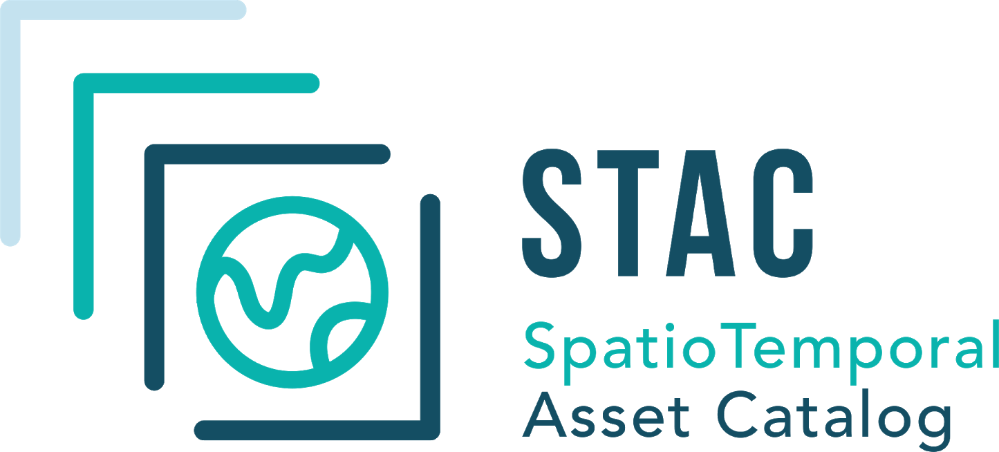
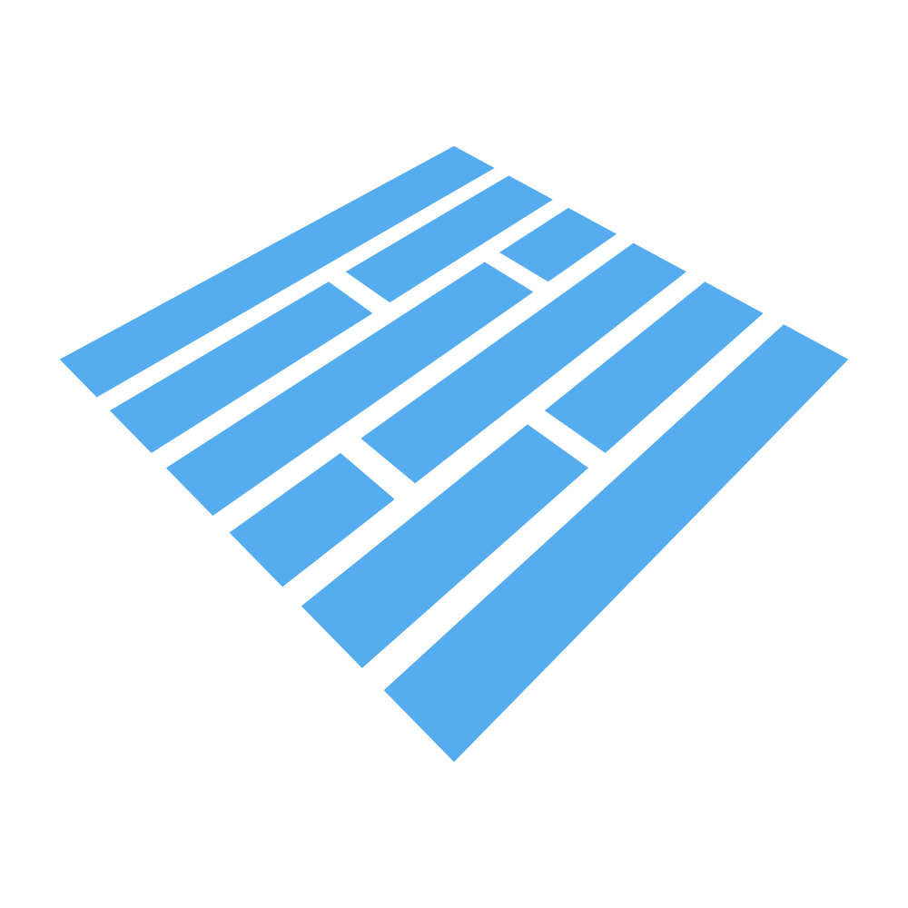
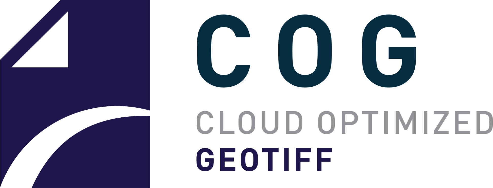
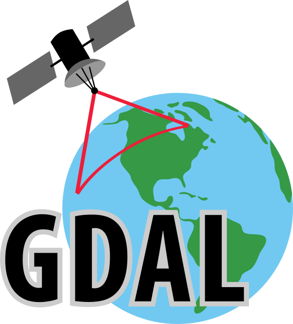
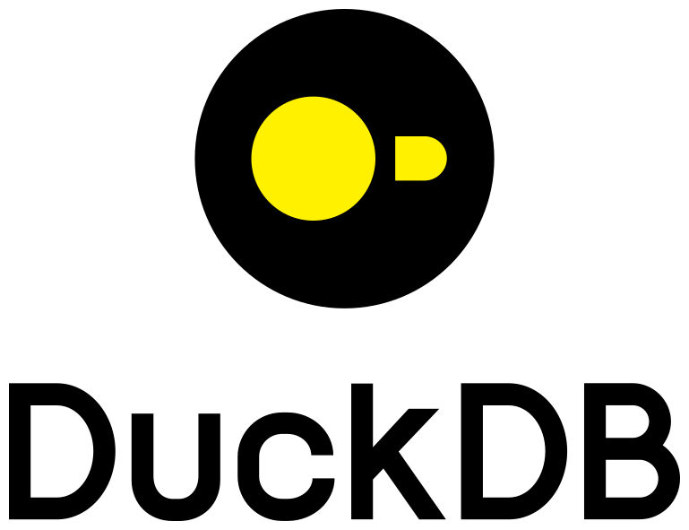
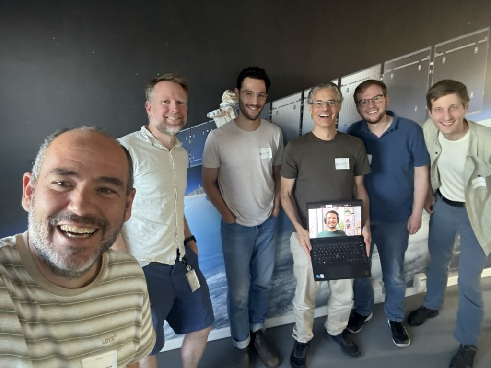

::: {#title-block .title-block}
```{=html}

<p class="title">Introducing Portolan</p>
<!-- "CNG" is set in the conference's own letterforms, lifted straight out of
     images/cng-logo.svg, rather than in a face that approximates them. Both
     SVGs inherit the line's colour through fill="currentColor". -->
<p class="subtitle"><span class="dots"><span style="--d:1.4s">.</span><span style="--d:2s">.</span><span style="--d:2.6s">.</span></span><span class="words" style="--d:3.3s">for</span><span class="cng words" style="--d:3.9s" role="img" aria-label="CNG"><svg class="cng-mark" viewBox="0 0 298.9 311.75" aria-hidden="true"><path fill="currentColor" d="M291.6 85.81 189.84 2.36C187.98.83 185.64 0 183.23 0h-35.76c-1.82 0-3.62.4-5.27 1.16L24.09 55.73c-4.5 2.08-7.59 6.37-8.14 11.3L.1 209.11a15.59 15.59 0 0 0 5.61 13.8l105.25 86.47c1.87 1.53 4.2 2.37 6.62 2.37h32.16c1.82 0 3.63-.4 5.28-1.16l120.56-55.85c4.22-1.96 7.11-5.98 7.63-10.6l15.57-140.72c.74-6.7-1.96-13.32-7.17-17.6ZM149.8 226.17c-69.08-19.75-67.08-121.75-.64-141.69 33.56 9.11 51.71 39.48 51.42 71.33-.27 30.38-18.2 61.67-50.78 70.36"/></svg><svg class="cng-word" viewBox="361.2 90.74 341.41 140" aria-hidden="true"><path fill="currentColor" d="M415.02 208.9c-21.69 0-28.11-10.42-28.11-47.87s6.42-48.46 28.11-48.46c14.26 0 19.28 4.4 21.89 19.03h25.1c-1.2-31.45-11.85-40.86-46.99-40.86-41.58 0-53.82 16.02-53.82 70.29s12.26 69.7 53.82 69.7c35.34 0 46.39-9.01 48.2-39.66h-25.1c-2.21 13.82-7.43 17.83-23.09 17.83ZM557.1 171.06l2.8 28.43h-.6L510.43 92.75h-31.24v136.18h24.64v-78.3l-2.81-28.44h.61l48.86 106.75h31.24V92.76H557.1zM649.66 174.05h28.28v30.65c-6.82 3-11.84 4.01-22.26 4.01-23.67 0-30.69-9.8-30.69-47.26s6.41-48.67 28.08-48.67c17.85 0 23.47 4.01 24.67 17.63h24.87c-1.61-30.65-13.04-39.66-49.74-39.66-40.92 0-53.15 16.02-53.15 70.09s12.83 69.9 56.56 69.9c17.65 0 28.08-2.41 45.93-10.62v-67.89h-52.54v21.83Z"/></svg></span></p>
<p class="byline">Chris Holmes · Cloud-Native Geospatial Conference · 2026</p>
```
:::

::: {.notes}
So I'm here to talk about Portolan, a project we publicly launched last month. But this talk is going to be a bit different from every other Portolan talk you'll see, because this audience is different from our typical target audience.
:::


## {#slide-02}

::: {.slide-head}
[Crossing the chasm]{.headline}
:::

::: {.slide-body}
```{=html}
<svg class="chasm" viewBox="0 0 1440 520" role="img" aria-label="Technology adoption curve, broken by a gap between the early adopters and the early majority.">
  <defs><clipPath id="bell"><path d="M110 430L110 426L118 425L126 425L134 424L143 423L151 423L159 422L167 421L175 420L183 419L191 417L199 416L208 415L216 413L224 411L232 409L240 407L248 405L256 403L265 400L273 397L281 394L289 391L297 388L305 384L313 381L321 377L330 372L338 368L346 363L354 358L362 353L370 348L378 342L387 336L395 330L403 324L411 317L419 311L427 304L435 297L443 289L452 282L460 274L468 267L476 259L484 251L492 243L500 236L509 228L517 220L525 212L533 204L541 197L549 189L557 182L565 175L574 168L582 161L590 155L598 149L606 143L614 138L622 133L631 129L639 125L647 121L655 118L663 115L671 113L679 112L687 111L696 110L704 110L712 111L720 112L728 113L736 115L744 118L753 121L761 124L769 128L777 133L785 138L793 143L801 149L809 155L818 161L826 167L834 174L842 181L850 189L858 196L866 204L875 211L883 219L891 227L899 235L907 243L915 251L923 258L931 266L940 274L948 281L956 289L964 296L972 303L980 310L988 317L997 323L1005 330L1013 336L1021 342L1029 347L1037 353L1045 358L1053 363L1062 368L1070 372L1078 376L1086 380L1094 384L1102 388L1110 391L1119 394L1127 397L1135 400L1143 402L1151 405L1159 407L1167 409L1175 411L1184 413L1192 414L1200 416L1208 417L1216 419L1224 420L1232 421L1241 422L1249 423L1257 423L1265 424L1273 425L1281 425L1289 426L1297 426L1306 427L1314 427L1322 427L1330 428L1330 430Z"/></clipPath></defs>
  <g clip-path="url(#bell)">
    <rect class="a-fade" style="--d:0.3s" x="110" y="60" width="190" height="370" fill="#3a9e82"/>
    <rect class="a-fade" style="--d:1.0s" x="299" y="60" width="180" height="370" fill="#9cc45a"/>
    <rect class="a-fade" style="--d:1.7s" x="522" y="60" width="179" height="370" fill="#e9a23d"/>
    <rect class="a-fade" style="--d:2.4s" x="700" y="60" width="201" height="370" fill="#b93a2b"/>
    <rect class="a-fade" style="--d:3.1s" x="899" y="60" width="432" height="370" fill="#45536a"/>
  </g>
  <g stroke="#9a9b90" stroke-width="1.5" stroke-dasharray="5 6" fill="none">
    <line x1="110" y1="40" x2="110" y2="430"/>
    <line x1="478" y1="40" x2="478" y2="430"/>
  </g>
  <g stroke="#16170f" stroke-width="2">
    <line x1="110" y1="430" x2="478" y2="430"/>
    <line x1="522" y1="430" x2="1330" y2="430"/>
    <line x1="478" y1="430" x2="478" y2="452"/>
    <line x1="522" y1="430" x2="522" y2="452"/>
    <line x1="299" y1="430" x2="299" y2="444"/>
    <line x1="700" y1="430" x2="700" y2="444"/>
    <line x1="899" y1="430" x2="899" y2="444"/>
  </g>
  <text class="band" x="294" y="26" text-anchor="middle">Early market</text>
  <text class="band" x="920" y="26" text-anchor="middle">Mainstream market</text>
  <text class="outside" x="205" y="352" text-anchor="middle">Tech enthusiasts</text>
  <text class="inside a-fade" style="--d:1.6s" x="405" y="400" text-anchor="middle">Visionaries</text>
  <text class="inside a-fade" style="--d:2.3s" x="611" y="330" text-anchor="middle">Pragmatists</text>
  <text class="inside a-fade" style="--d:3.0s" x="800" y="330" text-anchor="middle">Conservatives</text>
  <text class="inside a-fade" style="--d:3.7s" x="985" y="400" text-anchor="middle">Skeptics</text>
  <text class="seg-name" x="205" y="478" text-anchor="middle">Innovators</text>
  <text class="seg-pct"  x="205" y="506" text-anchor="middle">2.5%</text>
  <text class="seg-name" x="389" y="478" text-anchor="middle">Early adopters</text>
  <text class="seg-pct"  x="389" y="506" text-anchor="middle">13.5%</text>
  <text class="seg-name" x="611" y="478" text-anchor="middle">Early majority</text>
  <text class="seg-pct"  x="611" y="506" text-anchor="middle">34%</text>
  <text class="seg-name" x="800" y="478" text-anchor="middle">Late majority</text>
  <text class="seg-pct"  x="800" y="506" text-anchor="middle">34%</text>
  <text class="seg-name" x="1115" y="478" text-anchor="middle">Laggards</text>
  <text class="seg-pct"  x="1115" y="506" text-anchor="middle">16%</text>
  <g class="a-fade" style="--d:2.2s">
    <text class="here" x="150" y="150">CNG today</text>
    <path d="M186 166 L186 236 L404 318" fill="none" stroke="#4163cc" stroke-width="1.5"/>
    <circle cx="404" cy="318" r="4.5" fill="#4163cc"/>
  </g>
</svg>
```
:::

::: {.notes}
That's because our target audience is really people who have never heard of CNG. One of our main goals with Portolan is to take cloud-native geospatial beyond early adopters and to the mainstream, reaching users who don't want to hear about your cool technology.
:::


## {#slide-03}

::: {.slide-head}
[Why Portolan]{.headline}
:::

::: {.slide-body}
```{=html}
<div class="cols">
  <div class="a-rise" style="--d:0.2s">
    <h3>Open</h3>
    <p>GeoParquet, PMTiles, COG, STAC. Opens in QGIS, ArcGIS, pandas, BigQuery.</p>
  </div>
  <div class="a-rise" style="--d:0.45s">
    <h3>Cheap and sovereign</h3>
    <p>Files in a bucket. Any provider, any jurisdiction. No servers.</p>
  </div>
  <div class="a-rise" style="--d:0.7s">
    <h3>For people and agents</h3>
    <p>Documented well enough that both can actually use it.</p>
  </div>
</div>
```
:::

::: {.notes}
So most of the talks we give have slides that look like this, articulating the 'why' — and most of that is just trumpeting everything that CNG gets you. So a common reaction from people who are deep in CNG is "why would I need this?"

And if you already know how to tune each format…
:::


## {#slide-04}

::: {.center-v}
[Portolan is for everyone else.]{.statement .a-rise style="--d:0.3s"}
:::

::: {.notes}
…and you stay up to date with all the latest advances, and always make amazing catalogs — then the answer is, you don't. Portolan is for everyone else.

A Portolan catalog is a STAC catalog, with guidance and tools to help new users.
:::


## {#slide-05}

::: {.slide-head}
[A Portolan catalog]{.headline}
:::

::: {.slide-body}
```{=html}
<pre class="tree a-fade" style="--d:0.2s">catalog.json
├── <span class="k">AGENTS.md</span>                     <span class="c">for agents</span>
├── <span class="k">README.md</span>                     <span class="c">for people</span>
└── collections/
    ├── land-use/
    │   ├── collection.json
    │   ├── <span class="k">style.json</span>            <span class="c">cartography, as an asset</span>
    │   ├── land-use.pmtiles
    │   └── <span class="k">admin=*/*.parquet</span>     <span class="c">glob, partition extension</span>
    └── imagery/
        ├── collection.json
        ├── <span class="k">items.parquet</span>         <span class="c">stac-geoparquet</span>
        └── cogs/<span class="k">*.tif</span></pre>
```
:::

::: {.notes}
Structurally it'll look very familiar. But we remove a lot of the choice that CNG gives you, in favour of good defaults — like spatially sorted, zstd-compressed GeoParquets with reasonable row group sizes; or COGs with sufficient overviews and gdal stats embedded. And we provide a validator to help users and agents get it right.
:::


## {#slide-06 .bleed}

```{=html}
<video class="fill" src="media/data-browser.mp4" data-autoplay muted playsinline></video>
```

::: {.notes}
Our goal is to enable CNG to completely replace the traditional spatial data infrastructure APIs and portals. So we take a holistic lens on the ecosystem, to make sure we have all the pieces to deliver a complete experience — like this custom themed catalog I made for Portland TriMet.
:::


## {#slide-07 .bleed}

```{=html}
<video class="fill" src="media/buildings-3d.mp4" data-autoplay muted playsinline></video>
```

::: {.notes}
The holistic lens has forced us to solve a lot of issues at the edges of the formats, and it has led to a few advances that are interesting to people in this room: including styles as assets in a STAC catalog, adding glob syntax, and requiring the table extension.
:::


## {#slide-08 .bleed}

```{=html}
<video class="fill" src="media/s2-search.mp4" data-autoplay muted playsinline></video>
```

::: {.notes}
We're embracing stac-geoparquet to enable completely cloud-native search. I just put up all of Sentinel-2 in GeoParquet, and it took a bulk processing job I had from 20 hours down to 16 minutes. And you can see it also powering sub-second search responses across the entire Sentinel-2 archive.
:::


## {#slide-09 .bleed}

```{=html}
<video class="fill" src="media/git-backed.mp4" data-autoplay muted playsinline></video>
```

::: {.notes}
Another practice that has emerged is what we call a git-backed catalog. Most Portolan catalogs store their metadata and data scripts in git with CI, so changes are tested and if an agent messes up it's easy to roll back.
:::


## {#slide-10 .bleed}

```{=html}
<video class="fill" src="media/tulip-chat.mp4" data-autoplay muted playsinline></video>
```

::: {.notes}
And we added an AGENTS.md file, which enables pretty magical direct interaction with geospatial data. Most every agent can install DuckDB and do advanced geospatial analysis, and we believe this will ultimately open up the power of geospatial to many more users.
:::


## {#slide-11 .bleed}

```{=html}
<video class="fill" src="media/catalog-demo.mp4" data-autoplay muted playsinline></video>
```

::: {.notes}
We've also invested in various agentic skills to make it easy to translate entire catalogs into Portolan, and we're continually improving the connectors to ArcGIS, WFS and others. So making a great catalog is incredibly easy.
:::


## {#slide-12}

::: {.slide-head}
[Built on your work]{.headline}
:::

::: {.slide-body}
```{=html}
<!-- Three dependency trees, one per Portolan component. The connectors are
     drawn entirely with ::before/::after borders on each li, so the layout
     follows the text rather than hard-coded coordinates. -->
<div class="stack a-fade" style="--d:0.2s">

  <ul class="dep-tree">
    <li><span class="pnode">Portolan spec</span>
      <ul>
        <li><span class="dep logo tall"></span></li>
        <li><span class="dep logo tall mark"><span>GeoParquet</span></span>
          <ul><li><span class="dep logo mark"><span>Parquet</span></span></li></ul>
        </li>
        <li><span class="dep logo tall"></span></li>
      </ul>
    </li>
  </ul>

  <ul class="dep-tree">
    <li><span class="pnode">Portolan CLI</span>
      <ul>
        <li><span class="dep">rasterio</span>
          <ul><li><span class="dep logo mark"><span>GDAL</span></span></li></ul>
        </li>
        <li><span class="dep logo"></span>
          <ul>
            <li><span class="dep logo"></span></li>
            <li><span class="dep logo"></span></li>
            <li><span class="dep logo"></span>
              <ul><li><span class="dep">OGR</span></li></ul>
            </li>
          </ul>
        </li>
      </ul>
    </li>
  </ul>

  <ul class="dep-tree">
    <li><span class="pnode">Portolan Browser</span>
      <ul>
        <li><span class="dep logo"></span>
          <ul><li><span class="dep logo"></span></li></ul>
        </li>
        <li><span class="dep logo"></span></li>
        <li><span class="dep logo"></span></li>
        <li><span class="dep">deck.gl-raster</span></li>
      </ul>
    </li>
  </ul>

</div>
```
:::

::: {.notes}
We are aiming for a complete ecosystem, and we've been leveraging all the amazing work that this community has created. We're still targeting early adopters, and our goal is to have every geospatial tool understand Portolan, and to get hundreds of catalogs of open data in the format.
:::


<!-- The photo is 4:3, so unlike the recordings it is cropped to fill. -->
## {#slide-13 .bleed}

```{=html}

```

::: {.notes}
We're aiming to do that by working with as many of you as possible. We had a great sprint yesterday, where twelve of us produced X new catalogs with Y amounts of new data. Our focus for now is really the data — converting all the great global datasets, along with many key regional ones.
:::


## {#slide-14 .bleed}

```{=html}
<video class="fill" src="media/firms-explorer.mp4" data-autoplay muted playsinline></video>
```

::: {.notes}
With each new dataset converted, I hope we push the cloud-native geospatial ecosystem forward in a different way — and together we make great data products and push the edges of what's possible with CNG. This is one I did to explore 20 years of fire data.
:::


## {#slide-15 .bleed}

```{=html}
<video class="fill" src="media/registry.mp4" data-autoplay muted playsinline></video>
```

::: {.notes}
The other key bit of the ecosystem is the Portolan Registry, where all high quality catalogs get registered for everyone to query. It's like STAC Index, but with a guarantee to users that the data will always be well-documented and performant.
:::


## {#slide-16 .bleed}

```{=html}
<video class="fill" src="media/finland-demo.mp4" data-autoplay muted playsinline></video>
```

::: {.notes}
The goal is to gather enough global data to be able to answer complex geospatial questions with LLMs. We want to enable the type of analysis that would previously take a team of geospatial experts to pull in all the data and extract insights from. This demo shows getting insights about data centers from five Portolan catalogs.
:::


## {#slide-17}

::: {.center-v}
[All the world's data, in CNG formats.]{.statement .a-rise style="--d:0.2s"}
:::

::: {.notes}
We want to see all the world's data in CNG formats. We believe AI can help get us there, and that the world's data in CNG formats will enable anyone to use AI to get geospatial insights — increasing the users of geospatial information by at least a couple of orders of magnitude.
:::


## {#slide-18}

::: {.slide-head}
[Then, back across the chasm]{.headline}
:::

::: {.slide-body}
```{=html}
<!-- The same curve as slide 2, already drawn: this is the payoff, so only
     the blue and the lockup animate. The clipPath id differs because both
     diagrams live in the one document. -->
<svg class="chasm" viewBox="0 0 1440 520" role="img" aria-label="Technology adoption curve, broken by a gap between the early adopters and the early majority.">
  <defs><clipPath id="bell-end"><path d="M110 430L110 426L118 425L126 425L134 424L143 423L151 423L159 422L167 421L175 420L183 419L191 417L199 416L208 415L216 413L224 411L232 409L240 407L248 405L256 403L265 400L273 397L281 394L289 391L297 388L305 384L313 381L321 377L330 372L338 368L346 363L354 358L362 353L370 348L378 342L387 336L395 330L403 324L411 317L419 311L427 304L435 297L443 289L452 282L460 274L468 267L476 259L484 251L492 243L500 236L509 228L517 220L525 212L533 204L541 197L549 189L557 182L565 175L574 168L582 161L590 155L598 149L606 143L614 138L622 133L631 129L639 125L647 121L655 118L663 115L671 113L679 112L687 111L696 110L704 110L712 111L720 112L728 113L736 115L744 118L753 121L761 124L769 128L777 133L785 138L793 143L801 149L809 155L818 161L826 167L834 174L842 181L850 189L858 196L866 204L875 211L883 219L891 227L899 235L907 243L915 251L923 258L931 266L940 274L948 281L956 289L964 296L972 303L980 310L988 317L997 323L1005 330L1013 336L1021 342L1029 347L1037 353L1045 358L1053 363L1062 368L1070 372L1078 376L1086 380L1094 384L1102 388L1110 391L1119 394L1127 397L1135 400L1143 402L1151 405L1159 407L1167 409L1175 411L1184 413L1192 414L1200 416L1208 417L1216 419L1224 420L1232 421L1241 422L1249 423L1257 423L1265 424L1273 425L1281 425L1289 426L1297 426L1306 427L1314 427L1322 427L1330 428L1330 430Z"/></clipPath></defs>
  <g clip-path="url(#bell-end)">
    <rect x="110" y="60" width="190" height="370" fill="#3a9e82"/>
    <rect x="299" y="60" width="180" height="370" fill="#9cc45a"/>
    <rect x="522" y="60" width="179" height="370" fill="#e9a23d"/>
    <rect x="700" y="60" width="201" height="370" fill="#b93a2b"/>
    <rect x="899" y="60" width="432" height="370" fill="#45536a"/>
  </g>
  <g stroke="#9a9b90" stroke-width="1.5" stroke-dasharray="5 6" fill="none">
    <line x1="110" y1="40" x2="110" y2="430"/>
    <line x1="478" y1="40" x2="478" y2="430"/>
  </g>
  <g stroke="#16170f" stroke-width="2">
    <line x1="110" y1="430" x2="478" y2="430"/>
    <line x1="522" y1="430" x2="1330" y2="430"/>
    <line x1="478" y1="430" x2="478" y2="452"/>
    <line x1="522" y1="430" x2="522" y2="452"/>
    <line x1="299" y1="430" x2="299" y2="444"/>
    <line x1="700" y1="430" x2="700" y2="444"/>
    <line x1="899" y1="430" x2="899" y2="444"/>
  </g>
  <text class="band" x="294" y="26" text-anchor="middle">Early market</text>
  <text class="band" x="920" y="26" text-anchor="middle">Mainstream market</text>
  <text class="outside" x="205" y="352" text-anchor="middle">Tech enthusiasts</text>
  <text class="inside" x="405" y="400" text-anchor="middle">Visionaries</text>
  <text class="inside" x="611" y="330" text-anchor="middle">Pragmatists</text>
  <text class="inside" x="800" y="330" text-anchor="middle">Conservatives</text>
  <text class="inside" x="985" y="400" text-anchor="middle">Skeptics</text>
  <text class="seg-name" x="205" y="478" text-anchor="middle">Innovators</text>
  <text class="seg-pct"  x="205" y="506" text-anchor="middle">2.5%</text>
  <text class="seg-name" x="389" y="478" text-anchor="middle">Early adopters</text>
  <text class="seg-pct"  x="389" y="506" text-anchor="middle">13.5%</text>
  <text class="seg-name" x="611" y="478" text-anchor="middle">Early majority</text>
  <text class="seg-pct"  x="611" y="506" text-anchor="middle">34%</text>
  <text class="seg-name" x="800" y="478" text-anchor="middle">Late majority</text>
  <text class="seg-pct"  x="800" y="506" text-anchor="middle">34%</text>
  <text class="seg-name" x="1115" y="478" text-anchor="middle">Laggards</text>
  <text class="seg-pct"  x="1115" y="506" text-anchor="middle">16%</text>

  <!-- Portolan takes the mainstream. Clipped to the same curve, so the blue
       lands exactly over the pragmatists and the conservatives. -->
  <g clip-path="url(#bell-end)">
    <rect class="a-fade" style="--d:1.4s" x="522" y="60" width="179" height="370" fill="#4163cc"/>
    <rect class="a-fade" style="--d:2.6s" x="700" y="60" width="201" height="370" fill="#4163cc"/>
  </g>
  <!-- Portolan vertical lockup, from portolan-ops/brand/logos.
       Cream, because it sits on the accent. -->
  <g class="a-fade" style="--d:3.9s" fill="#fcfcfa" transform="translate(647.00 211.23) scale(1.29744)">
    <g fill="inherit">
    <g transform="translate(24.664 0) scale(1.54150)">
    <path d="M2.83 18.247l26.34-9.124L2.83 0z"/>
    <path d="M29.17 32V13.753L2.83 22.877z"/>
    </g>
    </g>
    <path fill="inherit" d="M0.000 87.259V68.300H6.066Q9.221 68.300 10.853 69.660Q12.485 71.020 12.485 73.740Q12.485 76.460 10.839 77.888Q9.194 79.316 6.066 79.316H3.128V87.259ZM3.128 76.515H5.739Q7.426 76.515 8.378 75.889Q9.330 75.263 9.330 73.795Q9.330 72.353 8.419 71.727Q7.507 71.102 5.739 71.102H3.128Z M20.672 87.504Q18.768 87.504 17.245 86.606Q15.722 85.708 14.865 84.131Q14.008 82.553 14.008 80.540Q14.008 78.528 14.865 76.950Q15.722 75.372 17.231 74.488Q18.741 73.604 20.672 73.604Q22.631 73.604 24.113 74.488Q25.596 75.372 26.466 76.950Q27.336 78.528 27.336 80.540Q27.336 82.553 26.480 84.131Q25.623 85.708 24.113 86.606Q22.604 87.504 20.672 87.504ZM20.699 84.838Q21.815 84.838 22.631 84.321Q23.447 83.804 23.882 82.825Q24.317 81.846 24.317 80.540Q24.317 79.208 23.882 78.242Q23.447 77.276 22.631 76.759Q21.815 76.243 20.699 76.243Q19.530 76.243 18.714 76.773Q17.898 77.303 17.463 78.256Q17.027 79.208 17.027 80.540Q17.027 81.846 17.463 82.825Q17.898 83.804 18.714 84.321Q19.530 84.838 20.699 84.838Z M29.839 87.259V73.849H32.885V77.467L32.314 77.548Q32.450 76.379 33.103 75.495Q33.756 74.611 34.694 74.107Q35.633 73.604 36.557 73.604Q37.210 73.604 37.809 73.767Q38.407 73.931 39.060 74.311L37.591 77.031Q37.292 76.841 36.816 76.719Q36.340 76.596 35.905 76.596Q35.333 76.596 34.776 76.814Q34.218 77.031 33.783 77.480Q33.348 77.929 33.130 78.636Q32.994 79.017 32.926 79.629Q32.858 80.241 32.858 81.329V87.259Z M45.724 87.504Q44.717 87.504 43.833 87.109Q42.949 86.715 42.433 85.831Q41.916 84.947 41.916 83.505V70.585L44.962 68.899V82.662Q44.962 83.804 45.302 84.416Q45.642 85.028 46.540 85.028Q46.812 85.028 47.179 84.960Q47.546 84.892 47.954 84.784V87.123Q47.410 87.313 46.853 87.408Q46.295 87.504 45.724 87.504ZM39.359 76.188V73.849H47.954V76.188Z M56.278 87.504Q54.374 87.504 52.850 86.606Q51.327 85.708 50.470 84.131Q49.614 82.553 49.614 80.540Q49.614 78.528 50.470 76.950Q51.327 75.372 52.837 74.488Q54.346 73.604 56.278 73.604Q58.236 73.604 59.718 74.488Q61.201 75.372 62.071 76.950Q62.942 78.528 62.942 80.540Q62.942 82.553 62.085 84.131Q61.228 85.708 59.718 86.606Q58.209 87.504 56.278 87.504ZM56.305 84.838Q57.420 84.838 58.236 84.321Q59.052 83.804 59.487 82.825Q59.922 81.846 59.922 80.540Q59.922 79.208 59.487 78.242Q59.052 77.276 58.236 76.759Q57.420 76.243 56.305 76.243Q55.135 76.243 54.319 76.773Q53.503 77.303 53.068 78.256Q52.633 79.208 52.633 80.540Q52.633 81.846 53.068 82.825Q53.503 83.804 54.319 84.321Q55.135 84.838 56.305 84.838Z M68.409 87.504Q67.103 87.504 66.233 86.701Q65.363 85.899 65.363 84.131V68.300H68.382V83.532Q68.382 84.158 68.667 84.444Q68.953 84.729 69.415 84.729Q69.660 84.729 69.919 84.675Q70.177 84.620 70.449 84.539V87.096Q69.932 87.313 69.388 87.408Q68.844 87.504 68.409 87.504Z M81.112 87.259 80.894 85.001V78.800Q80.894 77.494 80.105 76.827Q79.316 76.161 77.902 76.161Q76.814 76.161 75.767 76.583Q74.719 77.004 73.849 77.875L72.163 75.889Q73.468 74.665 74.937 74.135Q76.406 73.604 78.147 73.604Q80.867 73.604 82.376 74.978Q83.886 76.351 83.886 78.800V87.259ZM76.950 87.504Q75.454 87.504 74.298 86.960Q73.142 86.416 72.503 85.436Q71.863 84.457 71.863 83.152Q71.863 82.036 72.339 81.220Q72.815 80.404 73.577 79.942Q74.230 79.534 75.100 79.357Q75.971 79.180 76.923 79.180H81.139V81.438H77.358Q76.868 81.438 76.379 81.533Q75.889 81.628 75.508 81.873Q75.236 82.091 75.059 82.417Q74.883 82.744 74.883 83.179Q74.883 84.049 75.549 84.552Q76.215 85.056 77.331 85.056Q78.310 85.056 79.112 84.620Q79.915 84.185 80.404 83.424Q80.894 82.662 80.894 81.710L81.819 83.206Q81.492 84.620 80.785 85.586Q80.078 86.552 79.099 87.028Q78.120 87.504 76.950 87.504Z M86.851 87.259V73.849H89.870V76.814L89.326 76.950Q89.680 75.780 90.360 75.046Q91.040 74.311 91.951 73.958Q92.862 73.604 93.869 73.604Q96.126 73.604 97.391 74.896Q98.656 76.188 98.656 78.582V87.259H95.637V79.697Q95.637 77.902 94.984 77.059Q94.331 76.215 92.971 76.215Q91.965 76.215 91.271 76.691Q90.577 77.167 90.224 78.174Q89.870 79.180 89.870 80.731V87.259Z"/>
  </g>
</svg>
```
:::

::: {.notes}
Once we have a hundred or so catalogs and get the tools really nailed, our next goal will be to start to go after the early majority. We aim to get a number of case studies and logos in place to show that it's not just the crazy early adopters — but instead that it would be crazy not to adopt Portolan.
:::


<!-- Portrait art on a landscape slide, so it is centred at full height
     rather than top-anchored like the recordings. -->
## {#slide-19 .bleed}

```{=html}

```

::: {.notes}
If you're working on pushing CNG, you're already part of our community. But we'd love more of you to join our direct community and help us expand. We still need to add Zarr and COPC, so we'd love help with that, along with many other ideas.
:::


## {#slide-20 data-autoslide="0" data-state="no-bars"}

::: {.slide-head}
[A better way to work with geospatial data]{.headline}
:::

::: {.slide-body}
```{=html}
<div class="links a-fade" style="--d:0.2s">
  <a href="https://www.portolan-sdi.org/"><span>Project</span><span class="url">portolan-sdi.org</span></a>
  <a href="https://www.portolan-sdi.org/registry"><span>Registry</span><span class="url">portolan-sdi.org/registry</span></a>
  <a href="https://github.com/portolan-sdi"><span>Code</span><span class="url">github.com/portolan-sdi</span></a>
  <a href="https://www.portolan-sdi.org/spec"><span>Spec</span><span class="url">portolan-sdi.org/spec</span></a>
</div>
```
:::

::: {.notes}
Thank you. Come find me if you want to help with Zarr or COPC, or if you have a dataset you want to get into Portolan.
:::
